# Reco

Real-time chat with group rooms, DMs, voice channels and anonymous random matching.
One TypeScript codebase serves the web app and the iOS/Android apps; a Flask +
Socket.IO backend handles realtime traffic, and Postgres stores the data.

**Live demo:** https://chat-5wg8.onrender.com. Click **"Take a look first"** to open a
read-only demo room without an account; the **Match** tab shows the matching screen
too (starting a match needs an account, since it pairs you with real people). The
free instance sleeps when idle, so the first load can take up to a minute.

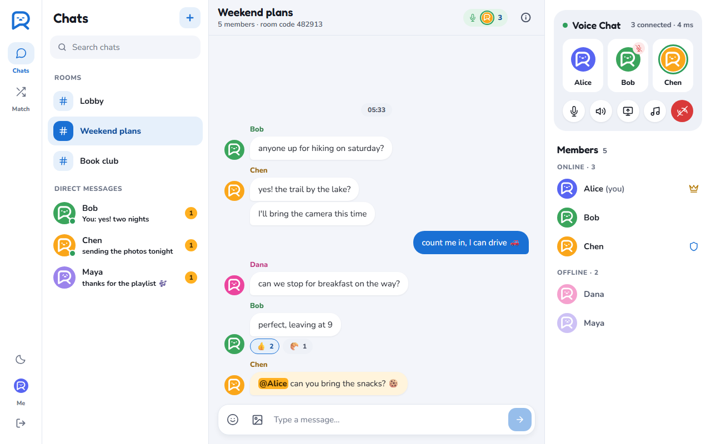

| Random match (desktop) | Random match (phone) | Chats with DM previews (phone) |
|---|---|---|
| 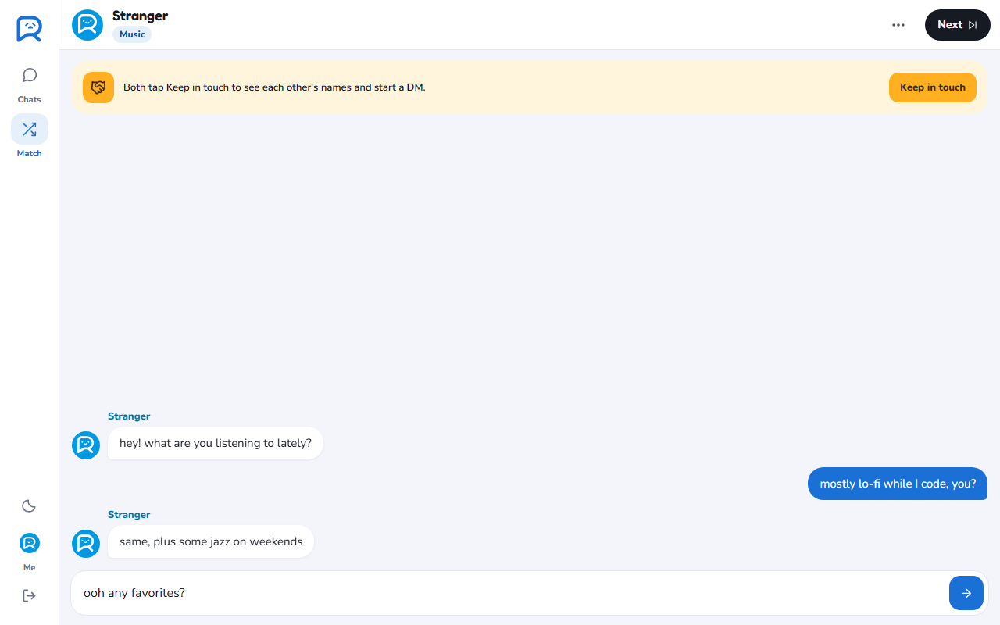 | 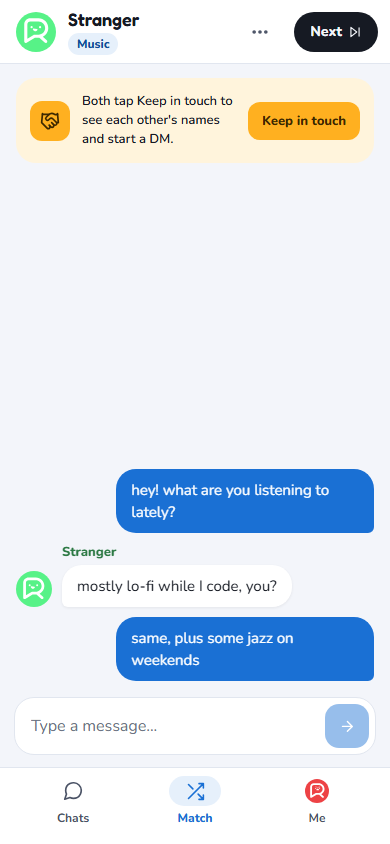 | 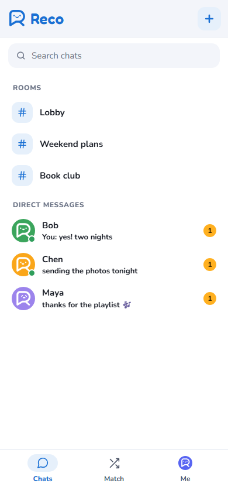 |

| Match setup | Profile card | Dark mode |
|---|---|---|
| 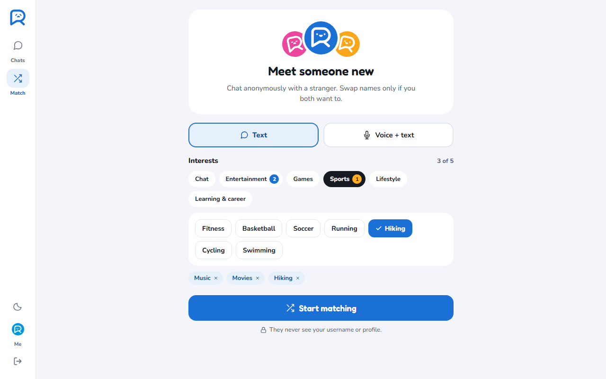 | 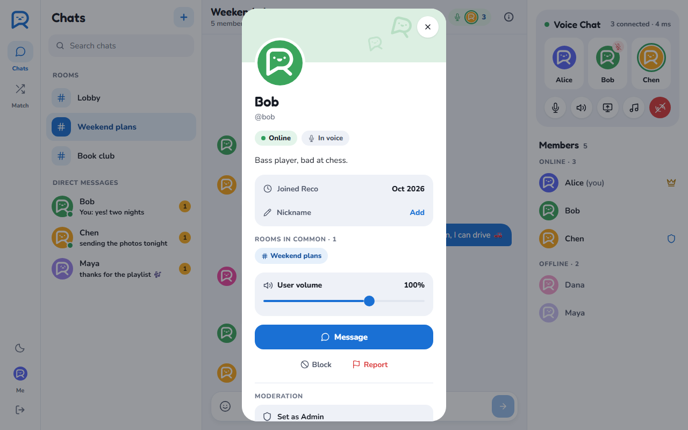 | 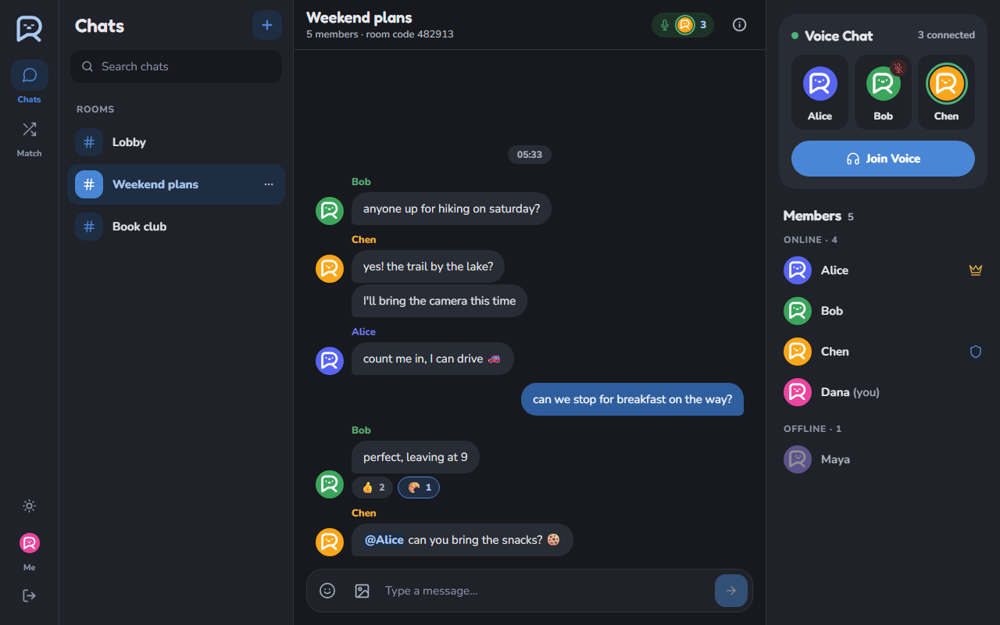 |

| Settings | Guest demo | Chinese UI |
|---|---|---|
| 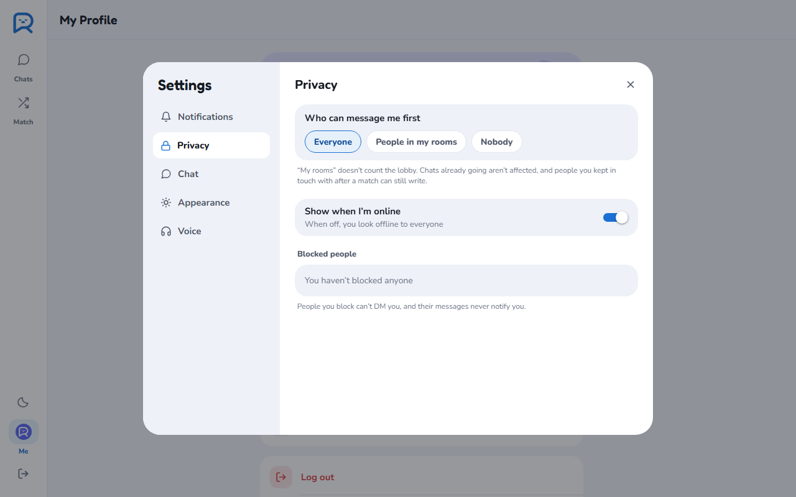 | 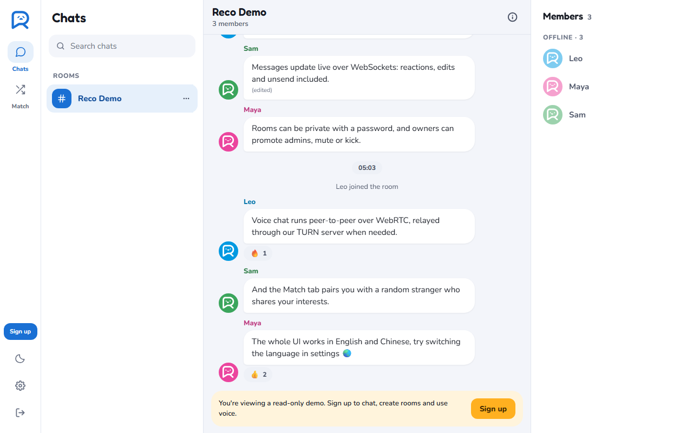 | 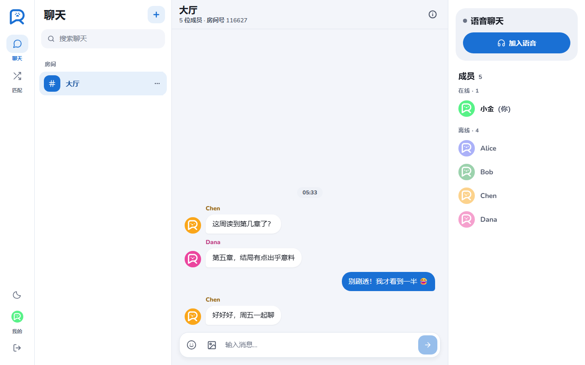 |

## Features

- **Sign in with GitHub or Google** (web), next to username and password. A new
  identity picks its username first; an existing account connects either provider
  from its profile, and can add a password later. Accounts are never matched up by
  email, no email or other scopes are requested, and the last way to sign in can't be
  removed.
- **Rooms and DMs:** public or password-protected rooms, invites, edits, recalls,
  emoji reactions, replies that quote the message they answer (tap the quote to jump
  back to it), "… is typing" and online presence. The DM list shows each
  conversation's last message and an online dot, kept live over the socket.
- **Messages show at once.** A sent message appears immediately with a spinner, and the
  server's acknowledgement swaps it for the stored one in place (matched by an id the
  client picks). If it isn't delivered (muted, blocked, a dropped connection, no answer
  in 15 s) it gets a red "!" and a tap sends it again. The server remembers recent
  client ids, so a resend after a lost acknowledgement is still stored only once.
- **@mentions:** typing @ in a room suggests its members by name or by the nickname you
  gave them (arrow keys, then Enter or Tab). The server works out who an @name really
  refers to (people in the room only) and stores that with the message, so every
  client shows it as @DisplayName. A message that mentions you is highlighted, the room
  says "Mentioned you" in your list until you read it, and you're notified even in a
  room you muted.
- **Profile cards:** tap anyone's avatar, name or @mention, a DM's title, or a member in
  the list. A card shows their bio, when they joined, when they were last online (as
  you could see it: someone who hides their status still counts as online to the person
  they just messaged, like Steam), the rooms you share, and a nickname only you see,
  which then replaces their name everywhere you see it. Owners and admins get the
  moderation that applies: unmute only if they're muted, a voice ban only while
  they're in voice.
- **Personal settings:** notifications (push in this browser; DMs, @mentions and
  matches each on or off; sounds), privacy (who can message you first: everyone,
  people in your rooms, or nobody; whether you show as online; your blocked list),
  chat (Enter sends or adds a line, text size, 12- or 24-hour clock), appearance
  (system, light or dark) and voice devices. Account settings live on the server and
  follow you to every device; how the app looks stays per device.
- **Chat cards:** every room and DM has a card (like a QQ group's settings or a Discord
  server's sheet): pin it to the top of your list, mute its notifications (no push, no
  sound, a quiet grey badge), search its history (tapping a result loads older pages
  until the message is on screen) and browse its photos. Pins and mutes live on the
  server, so every device agrees. On phones the list's rows slide left to pin, mute or
  close; on desktop a ⋯ on hover does the same.
- **Room settings for owners and admins:** a description and an announcement (posted
  in the chat when it changes), who can join (anyone with the code, code and password,
  or invited only), a ban list with undo, and a moderation log of every kick, mute,
  promotion and recall, including the site admin's actions from `/admin`.
- **Unread counts that follow you:** the server keeps a read mark per person and room,
  so a badge cleared on the phone is cleared on the laptop too. Marks move when a
  chat is opened and while new messages arrive on screen, never backwards.
- **Photos:** pick a file or paste a screenshot. The browser shrinks it to 1600 px
  and re-encodes it as JPEG (which drops EXIF, location included) before upload; the
  server checks the type and size from the file's own bytes, caps it at 2 MB, and
  serves it only once sent, until the message is recalled.
- **Message history:** the most recent page loads on join, and older messages load on
  demand. Clients that reconnect after missing more than a page get a clean reset
  instead of a gap.
- **Voice channels:** WebRTC audio (mesh) with mute, speaking indicators (also for
  people who were already talking when you joined), device selection, screen sharing
  and reconnecting by itself after a dropped connection. Voice goes through a self-hosted TURN server using
  short-lived HMAC credentials.
- **Random matching:**
  - Pick text or voice + text, plus up to five interests from a categorized catalog,
    then get paired with a stranger. Tags are ids from one JSON file that both the
    client and the server read, so labels are translated and Chinese and English
    users who share an interest still match.
  - The queue prefers the most shared interests and widens to anyone after 10
    seconds. It never re-pairs you with your last partner or with someone you
    blocked.
  - **Anonymous by design:** the server never sends the other person's identity.
    Both people see only "Stranger" and a random avatar until both press *Keep in
    touch*. Then both identities are revealed and a DM opens.
  - Voice matches are forced through the TURN relay (`iceTransportPolicy: 'relay'`),
    so neither side learns the other's IP address.
  - Report ends the chat, blocks the person and files the transcript for moderators.
    Transcripts are deleted after 7 days.
- **Guest demo:** visitors can browse a seeded, read-only demo room and preview the
  matching screen. Every write-type event (matching included) is rejected on the
  server, not just hidden in the UI.
- **Moderation panel** (`/admin`): users (reset password, rename, delete), rooms
  (kick, text and voice restrictions, recall), reports with match transcripts, and
  feedback.
- **Polish:** English and Chinese UI (server errors are sent as codes and translated
  on the client), a quiet dark mode, a responsive layout (nav rail plus three columns
  on desktop, tabs on mobile), touch gestures on phones (swipe back, swipe for the
  member list, slide a DM away, double-tap to 👍, drag sheets down), an emoji picker
  with search and recents, installable as a home-screen app, and push notifications
  for offline users on native.
- **Browser notifications** (web push): a DM, or a match found while you wait in
  another tab, shows up as a system notification, and clicking it opens that chat.
  The app asks in its own words first and only then triggers the browser's permission
  prompt (a blocked prompt can't be asked again). A notification goes out only when
  none of your tabs has Reco on screen. Endpoints are accepted only at the real push
  services, since the server POSTs to whatever is stored (no SSRF). On iPhone it
  explains Add to Home Screen, which iOS requires for web push.
- **Error reporting:** uncaught browser errors are posted to the backend, which sends
  them to the same Sentry project as server errors (tagged `side: web`), so the page
  ships no Sentry SDK. A crashed screen shows a friendly reload page instead of a
  blank one.

## Architecture

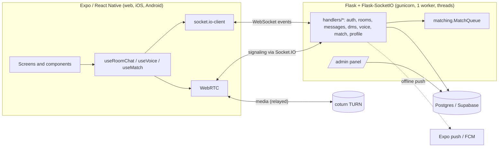

- **Identity is always server-side.** A socket is bound to a user through a signed
  token that embeds a fingerprint of the password hash, so changing the password
  logs out every other session. Handlers receive the verified username; nothing
  trusts a username sent by the client.
- **OAuth without tokens in URLs.** A signed, HttpOnly `state` cookie ties the
  provider's callback to the browser that started it. The callback hands the app a
  short-lived, single-use ticket in the URL fragment (never sent to servers or in
  `Referer`), which the app trades over the socket for a normal session. The
  provider's access token is used once to read the account id, then dropped.
- **Sends are acknowledged and idempotent.** The `message` event answers with a Socket.IO
  acknowledgement (`{ok, id}` or `{ok: false, code}`) and the broadcast carries the
  sender's client id, so the client can show a message before the server has it and
  resend it safely.
- **Replies are codes, not strings.** For example, `fail('join', 'wrong_password')`.
  The client's i18n layer turns them into text, and a test checks that every server
  code has a translation.
- **The match queue is pure logic** (`matching.py`, with an injectable clock and no
  I/O), so pairing rules are unit-tested directly. The Socket.IO layer
  (`handlers/match.py`) only relays events between the two sides of a match.

## Tech stack

| | |
|---|---|
| Frontend | Expo SDK 54, React Native 0.81, react-native-web, expo-router, Zustand, TypeScript |
| Realtime | Socket.IO (Flask-SocketIO 5 / socket.io-client 4), WebRTC (react-native-webrtc on native) |
| Backend | Python 3.11, Flask 3, gunicorn (threaded), psycopg2 with a bounded connection pool |
| Data | PostgreSQL (Supabase in production) |
| Infra | Render (web service), coturn (TURN), Sentry (optional), Expo push |
| Tests | pytest with a throwaway Postgres, Playwright e2e, `node --test` for frontend logic, ruff, ESLint, tsc, GitHub Actions |

## Running locally

Requirements: Python 3.11, Node 20+ and a Postgres database (a free Supabase project
works).

```bash
# backend
python -m venv .venv
.venv/Scripts/activate            # Windows; use `source .venv/bin/activate` on macOS/Linux
pip install -r requirements.txt

# .env in the repo root
DATABASE_URL=postgresql://...
SECRET_KEY=any-long-random-string

# frontend + backend together (Flask on :5000, Expo web on :8081)
cd app
npm install --legacy-peer-deps
npm run dev
```

The schema is created and migrated automatically on startup.

| Variable | Purpose |
|---|---|
| `DATABASE_URL` | Postgres connection string (required) |
| `SECRET_KEY` | Signs session tokens (required in production) |
| `ADMIN_PASSWORD` | Enables the `/admin` panel |
| `TURN_HOST`, `TURN_PORT`, `TURN_SECRET` | TURN server for voice; without it voice falls back to STUN only, and voice matching is disabled |
| `SENTRY_DSN` | Error reporting (optional) |
| `GITHUB_CLIENT_ID`, `GITHUB_CLIENT_SECRET` | Sign in with GitHub (optional; callback `<site>/auth/github/callback`) |
| `GOOGLE_CLIENT_ID`, `GOOGLE_CLIENT_SECRET` | Sign in with Google (optional; callback `<site>/auth/google/callback`) |
| `VAPID_PUBLIC_KEY`, `VAPID_PRIVATE_KEY` | Browser notifications (optional; a P-256 key pair, base64url) |
| `PUBLIC_URL` | The site's address for OAuth callbacks (Render's `RENDER_EXTERNAL_URL` is used when unset) |
| `APP_URL` | Where OAuth sends the browser back, if the web app runs elsewhere (local Expo dev: `http://localhost:8081`) |
| `CORS_ORIGINS` | Allowed origins for Socket.IO (default `*`) |
| `PRIVACY_CONTACT_EMAIL` | Shown on `/privacy` |
| `DB_POOL_MAX` | Max database connections (default 10) |

## Tests

```bash
pip install -r requirements-dev.txt
python -m playwright install chromium
pytest                       # 287 backend tests + 42 browser end-to-end tests
pytest --ignore=tests/test_e2e_web.py --cov=.    # backend line coverage

cd app
npm run typecheck && npm run lint && npm test     # 42 frontend unit tests
```

The backend tests start a disposable Postgres (via `pgserver`) and drive the real
Socket.IO server with test clients; they cover 88% of the backend's lines. The
end-to-end tests serve the production web build (`cd app && npx expo export -p web`
first) and use Playwright to cover flows such as:

- two browsers exchanging messages live, and messages showing right after a reload
- a message that wasn't delivered, sent again with a tap
- @mentioning someone, and their list saying so
- a profile card opened from a message, taking a nickname
- voice: mute, deafen, leave and rejoin, coming back after the connection drops, and
  an admin removing someone
- the guest demo staying read-only
- two strangers matching, chatting and both choosing to keep in touch

CI runs all of this, plus a gunicorn and WebSocket smoke test of the production
server.

## Load test

`tests/load_gunicorn.py` (run by hand: Actions → Load test) starts the production setup,
gunicorn with `gunicorn.conf.py`, on a 4-vCPU GitHub runner and adds signed-in users to
one room in stages. At each stage five people send four messages each at the same
moment, and every user in the room should receive every message. Fan-out is the time
from sending to arriving at each receiver.

| Threads | Users in the room | Couldn't connect | Delivered | Fan-out p50 | Fan-out p95 |
|---|---|---|---|---|---|
| 100 | 100 | 0 | 100% | 302 ms | 478 ms |
| 100 | 125 | **25** | 100% (to the 100 online) | 320 ms | 480 ms |
| 400 | 150 | 0 | 100% | 346 ms | 508 ms |
| 400 | 200 | 0 | 100% | 1.3 s | 1.4 s |
| 400 | 300 | 0 | 95.3% | 6.5 s | 6.6 s |

- **A hard ceiling at the thread count.** Each WebSocket holds a thread, so with 100
  threads the 101st person could not connect at all (everyone already online was
  unaffected). Production now runs 200.
- **Then the broadcast.** With threads to spare, one process sending every message to
  every socket in turn is the limit: smooth up to 150 people in one room, slow at 200.
  A ping stayed at about 12 ms throughout, so the connections were fine and fan-out was
  the bottleneck. The next step is several workers sharing the Socket.IO Redis message
  queue (see below).

The clients run on the same machine as the server, and the production instance is much
smaller than the runner, so these numbers describe the design, not the live site's
capacity.

## Deployment

Render builds with `./build.sh` (backend dependencies, then the web app into
`app/dist`, which is not committed) and runs `gunicorn wsgi:app`, with
`gunicorn.conf.py` supplying the settings. CI runs the same production build on
every push, so a change that wouldn't build never reaches the host.
`wsgi.py` runs migrations on boot. Flask serves the Expo web build from `app/dist`,
so the app and the API share one origin. `/health` checks the database for Render's health
check.

## Trade-offs and what I'd change at scale

- **One process.** Presence, voice rooms, the match queue and rate limits live in
  memory, so the server runs a single gunicorn worker with 200 threads (the load test
  above shows where that ends). Scaling out
  would mean moving that state to Redis and using the Socket.IO Redis message queue.
  The pure `MatchQueue` was written so it can be swapped for a Redis-backed one.
- **Mesh voice.** Each participant connects to every other participant, which is
  fine for small rooms. Larger rooms would need an SFU such as LiveKit or mediasoup.
- **Photos in Postgres.** Images are stored as `BYTEA` next to the messages: no
  extra service or credentials, and plenty at this scale since browsers shrink them
  first. With real traffic they would move to object storage (S3, R2) behind a CDN,
  with the database keeping only the key.
- **Search is a plain `ILIKE`** over one chat's messages (wildcards escaped), newest
  first, 30 at a time. Fine for chats of this size; with real volume it would move to
  Postgres full-text search or a `pg_trgm` index.
- **Unread counts by read mark, not per message.** One row per person and room
  (`last_read_id`) keeps writes to one upsert per chat opened, instead of a receipt
  per message per reader; the cost is no "seen by" list.
- **Relay-only voice for strangers** costs TURN bandwidth. It is the price of not
  exposing IP addresses to anonymous partners.
- **Retention.** Match transcripts exist only so reports can be reviewed. A
  background job deletes them after 7 days.

## License

© 2026 HFbise. All rights reserved. The source is public for portfolio review;
no license is granted to use, copy, modify or distribute it.
