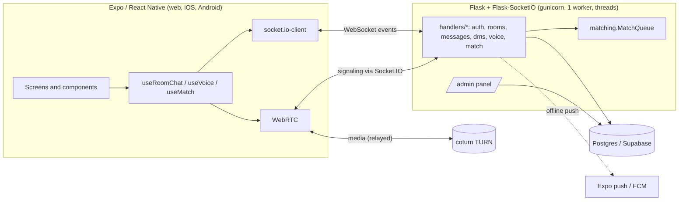

# Reco

Real-time chat with group rooms, DMs, voice channels and anonymous random matching.
One TypeScript codebase serves the web app and the iOS/Android apps; a Flask +
Socket.IO backend handles realtime traffic, and Postgres stores the data.

**Live demo:** https://chat-5wg8.onrender.com. Click **"Take a look first"** to open a
read-only demo room without an account. The free instance sleeps when idle, so the
first load can take up to a minute.


| Random match (desktop) | Random match (mobile) | Dark mode |
|---|---|---|
|  |  |  |

| Match setup | Guest demo | Chinese UI |
|---|---|---|
|  |  |  |

## Features

- **Rooms and DMs:** public or password-protected rooms, invites, unread badges,
  edits, recalls, emoji reactions and online presence.
- **Message history:** the most recent page loads on join, and older messages load on
  demand. Clients that reconnect after missing more than a page get a clean reset
  instead of a gap.
- **Voice channels:** WebRTC audio (mesh) with mute, speaking indicators, device
  selection and screen sharing. Voice goes through a self-hosted TURN server using
  short-lived HMAC credentials.
- **Random matching:**
  - Pick text or voice and optional interest tags, then get paired with a stranger.
  - The queue prefers the most shared interests and widens to anyone after 10
    seconds. It never re-pairs you with your last partner or with someone you
    blocked.
  - **Anonymous by design:** the server never sends the other person's identity.
    Both people see only "Stranger" and a random avatar until both press *Keep in
    touch*. Then both identities are revealed and a DM opens.
  - Voice matches are forced through the TURN relay (`iceTransportPolicy: 'relay'`),
    so neither side learns the other's IP address.
  - Report ends the chat, blocks the person and files the transcript for moderators.
    Transcripts are deleted after 7 days.
- **Guest demo:** visitors can browse a seeded, read-only demo room. Every
  write-type event is rejected on the server, not just hidden in the UI.
- **Moderation panel** (`/admin`): users (reset password, rename, delete), rooms
  (kick, text and voice restrictions, recall), reports with match transcripts, and
  feedback.
- **Polish:** English and Chinese UI (server errors are sent as codes and translated
  on the client), dark mode that follows the system, a responsive layout (nav rail
  plus three columns on desktop, tabs on mobile), and push notifications for offline
  users on native.

## Architecture



- **Identity is always server-side.** A socket is bound to a user through a signed
  token that embeds a fingerprint of the password hash, so changing the password
  logs out every other session. Handlers receive the verified username; nothing
  trusts a username sent by the client.
- **Replies are codes, not strings.** For example, `fail('join', 'wrong_password')`.
  The client's i18n layer turns them into text, and a test checks that every server
  code has a translation.
- **The match queue is pure logic** (`matching.py`, with an injectable clock and no
  I/O), so pairing rules are unit-tested directly. The Socket.IO layer
  (`handlers/match.py`) only relays events between the two sides of a match.

## Tech stack

| | |
|---|---|
| Frontend | Expo SDK 54, React Native 0.81, react-native-web, expo-router, Zustand, TypeScript |
| Realtime | Socket.IO (Flask-SocketIO 5 / socket.io-client 4), WebRTC (react-native-webrtc on native) |
| Backend | Python 3.11, Flask 3, gunicorn (threaded), psycopg2 with a bounded connection pool |
| Data | PostgreSQL (Supabase in production) |
| Infra | Render (web service), coturn (TURN), Sentry (optional), Expo push |
| Tests | pytest with a throwaway Postgres, Playwright e2e, `node --test` for frontend logic, ruff, ESLint, tsc, GitHub Actions |

## Running locally

Requirements: Python 3.11, Node 20+ and a Postgres database (a free Supabase project
works).

```bash
# backend
python -m venv .venv
.venv/Scripts/activate            # Windows; use `source .venv/bin/activate` on macOS/Linux
pip install -r requirements.txt

# .env in the repo root
DATABASE_URL=postgresql://...
SECRET_KEY=any-long-random-string

# frontend + backend together (Flask on :5000, Expo web on :8081)
cd app
npm install --legacy-peer-deps
npm run dev
```

The schema is created and migrated automatically on startup.

| Variable | Purpose |
|---|---|
| `DATABASE_URL` | Postgres connection string (required) |
| `SECRET_KEY` | Signs session tokens (required in production) |
| `ADMIN_PASSWORD` | Enables the `/admin` panel |
| `TURN_HOST`, `TURN_PORT`, `TURN_SECRET` | TURN server for voice; without it voice falls back to STUN only, and voice matching is disabled |
| `SENTRY_DSN` | Error reporting (optional) |
| `CORS_ORIGINS` | Allowed origins for Socket.IO (default `*`) |
| `PRIVACY_CONTACT_EMAIL` | Shown on `/privacy` |
| `DB_POOL_MAX` | Max database connections (default 10) |

## Tests

```bash
pip install -r requirements-dev.txt
python -m playwright install chromium
pytest                       # ~130 tests, including browser end-to-end tests

cd app
npm run typecheck && npm run lint && npm test
```

The backend tests start a disposable Postgres (via `pgserver`) and drive the real
Socket.IO server with test clients. The end-to-end tests build nothing: they serve
the committed web build (`app/dist`) and use Playwright to cover these flows:

- two browsers exchanging messages live
- the guest demo staying read-only
- two strangers matching, chatting and both choosing to keep in touch

CI runs all of this, plus a gunicorn and WebSocket smoke test of the production
server.

## Deployment

Render runs `gunicorn wsgi:app`, and `gunicorn.conf.py` supplies the settings.
`wsgi.py` runs migrations on boot. Flask serves the Expo web build from `app/dist`,
so the app and the API share one origin. `/health` checks the database for Render's health
check.

## Trade-offs and what I'd change at scale

- **One process.** Presence, voice rooms, the match queue and rate limits live in
  memory, so the server runs a single gunicorn worker with 100 threads. Scaling out
  would mean moving that state to Redis and using the Socket.IO Redis message queue.
  The pure `MatchQueue` was written so it can be swapped for a Redis-backed one.
- **Mesh voice.** Each participant connects to every other participant, which is
  fine for small rooms. Larger rooms would need an SFU such as LiveKit or mediasoup.
- **Committed web build.** `app/dist` is checked in so the Python-only host needs no
  Node build step. With a CI deploy pipeline, the build would move there.
- **Relay-only voice for strangers** costs TURN bandwidth. It is the price of not
  exposing IP addresses to anonymous partners.
- **Retention.** Match transcripts exist only so reports can be reviewed. A
  background job deletes them after 7 days.
